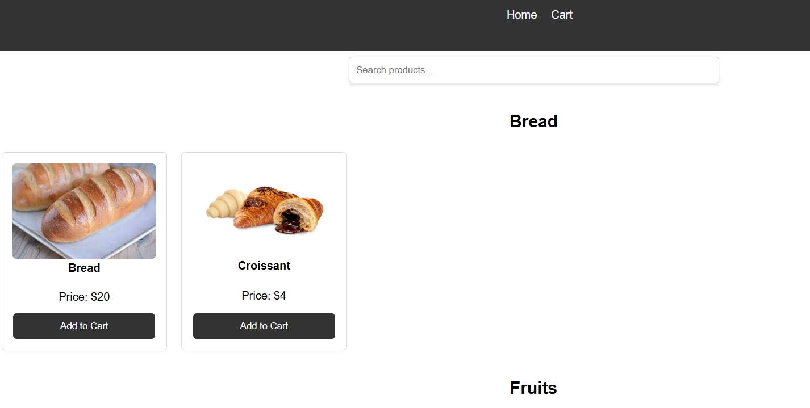
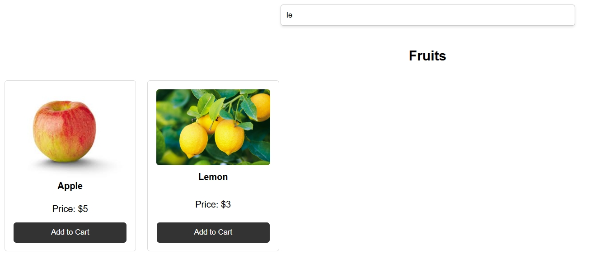
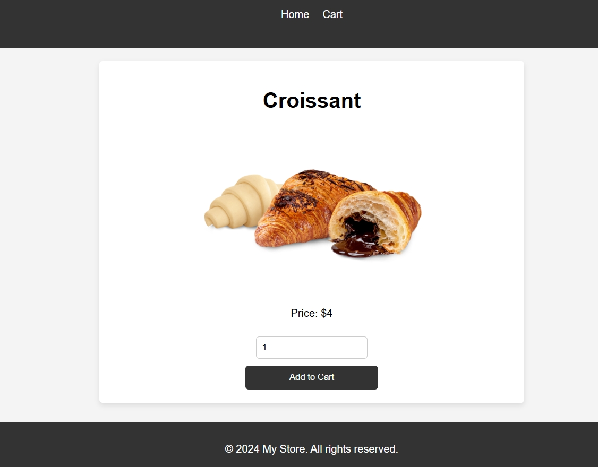
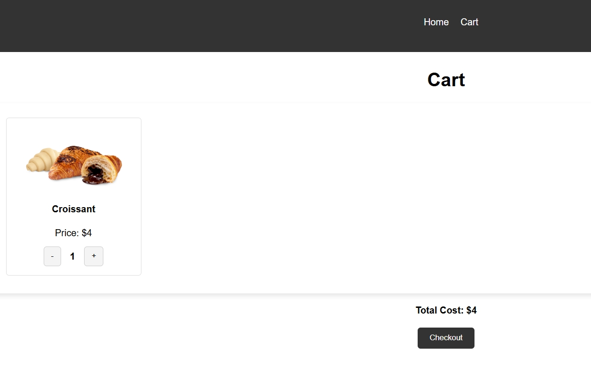
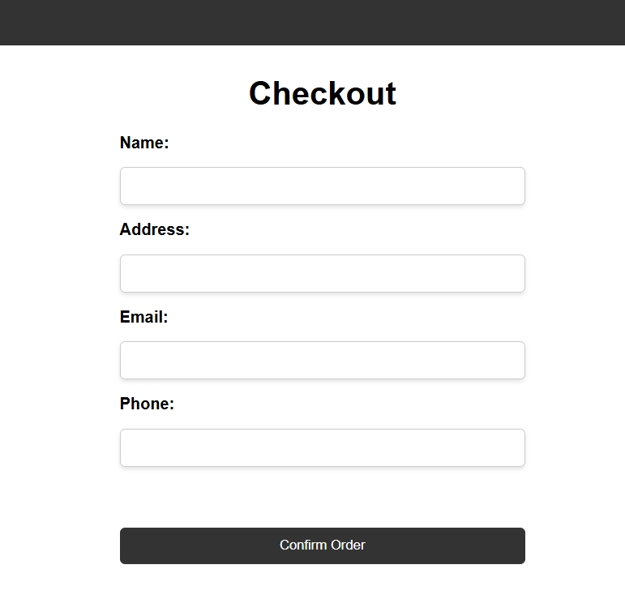

# Simple Shop

---

##

[](https://img.shields.io/badge/node.js-339933?style=for-the-badge&logo=Node.js&logoColor=white) [](https://img.shields.io/badge/Express%20js-000000?style=for-the-badge&logo=express&logoColor=white) [](https://shields.io/badge/JavaScript-F7DF1E?logo=JavaScript&logoColor=000&style=flat-square) [](https://img.shields.io/badge/-MongoDB-13aa52?style=for-the-badge&logo=mongodb&logoColor=white)

## About

---

✨ This is very simple product shop with dynamical pages and MongoDB connection. ✨

[](./assets/main.jpg)

## Features

---

- The list of all available products, divided by categories
- Clickable product item, which leads to product page
- Ability to add product to cart and increase/decrease the amount
- Total price calculation
- Dynamical search by product name
- Form and payload validation before sending order info to db

### How working app looks like

---

[](./assets/searchbar.jpg)

[](./assets/product.jpg)

[](./assets/cart.jpg)

[](./assets/checkout.jpg)

## Installation

---

If you are a developer, you will need [Node.js](https://nodejs.org/) v20+. Don't forget to create .env file as shown in .env.example!

To run app locally, clone repo and navigate to backend folder where you must install dependencies:

```sh
cd backend
npm install
npm run start
```

Once the server started, you will see the message in terminal about port and database connection.

After this, make sure you have Live Server extension installed in your VSCode, then open folder **frontend/pages/index.html** and push the button **"Go live"**. If all works right, you should see the main page of the application.

